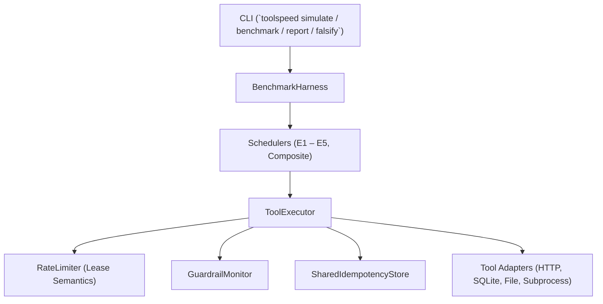

# ToolSpeed Runtime Architecture

This document describes the software architecture, safety boundaries, scheduler implementations, and execution lifecycle of ToolSpeed.

## Architecture Overview

## Component Breakdown

### 1. `ToolExecutor` (`toolspeed/schedulers/executor.py`)
- Centralized execution gate for all tool invocations.
- Strict schema validation against JSON schema parameter definitions.
- Safety enforcement: Mutative tools cannot be executed speculatively or early.
- Approval enforcement: Actions requiring approval cannot execute without explicit caller authorization.
- Shared idempotency caching across scheduler runs.
- Rate limit leasing with token-first, concurrency-second ordering.

### 2. Schedulers
- **`DAGScheduler` (E1)**: Dynamically builds dependency graphs with cycle detection and parallel async wave execution.
- **`JITFusionScheduler` (E2)**: Compiles known pipelines into bounded declarative ASTs with data invariants and safe ledger deopt.
- **`SpeculativeReadScheduler` (E3)**: Dispatches confidence-gated read-only tools concurrently with model reasoning.
- **`CommitHorizonScheduler` (E4)**: Streams tokens incrementally and commits syntactically closed, idempotent read operations early.
- **`ActionBytecodeScheduler` (E5a)**: Binary transport codec with bounds checking and duplicate key rejection.
- **`CacheScheduler`**: Exact & semantic result caching with automatic mutation invalidation.
- **`CompositeScheduler`**: Combines prewarming, caching, DAG parallelization, speculation, and streaming commit horizons.

### 3. Rate Limiter (`toolspeed/core/rate_limiter.py`)
- Uses `async with limiter.lease(tokens=1, deadline=deadline):`
- Prevents holding a concurrency slot while waiting for token refills.
- Guarantees clean cleanup on cancellation without leaking slots or dropping tokens.
