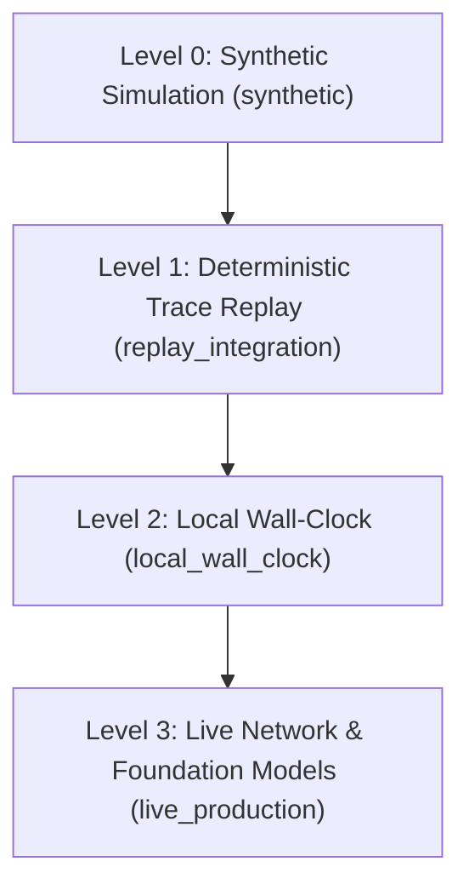

# ToolSpeed Evidence Level Hierarchy

ToolSpeed strictly classifies all experimental data, benchmark artifacts, and scientific claims under four standardized evidence levels.

## Level Definitions

### 1. `synthetic` (Level 0: Synthetic Analytical Simulation)
- **Execution Mechanism**: Analytical Monte Carlo modeling, parameter sampling, and theoretical math equations.
- **Evidence Characteristics**: Validates mathematical models and theoretical latency bounds.
- **Real-World Status**: Explicitly **INCONCLUSIVE** for empirical claims. Must never be presented as proof of real-world latency reductions.

### 2. `replay_integration` (Level 1: Deterministic Trace Replay)
- **Execution Mechanism**: Actual scheduler code executing against deterministic mock LLMs and mock tool adapters with configured synthetic delay fixtures.
- **Evidence Characteristics**: Validates scheduler concurrency logic, task cancellation safety, DAG resolution, error handling, and state transitions.
- **Real-World Status**: Validates software architecture and scheduling algorithms; wall-clock figures reflect fixture latencies.

### 3. `local_wall_clock` (Level 2: Local OS Primitives)
- **Execution Mechanism**: Actual scheduler code executing against local OS primitives: HTTP servers on `127.0.0.1`, in-memory/file SQLite databases, local File I/O sandboxes, and subprocess Python executors.
- **Evidence Characteristics**: Monotonic wall-clock measurements (`time.perf_counter_ns`), real process spawning, socket communication, and OS concurrency.
- **Real-World Status**: Rigorous empirical proof of local runtime performance without cloud network jitter.

### 4. `live_production` (Level 3: Live Network & Foundation Models)
- **Execution Mechanism**: Live cloud LLM API calls (e.g. Gemini, OpenAI, Claude) and external remote SaaS tool endpoints.
- **Evidence Characteristics**: Empirical network latency, provider rate limits, live token generation variance, and remote API behavior.
- **Current Status in PR #1**: Scoped as future work; live API experiments are not run in this phase to prevent unmetered external spend.
